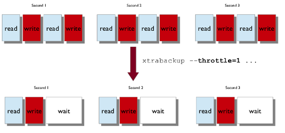

# Throttling Backups

Although *xtrabackup* does not block your database’s operation, any backup
can add load to the system being backed up. On systems that do not have
much
spare I/O capacity, it might be helpful to throttle the rate at which
*xtrabackup* reads and writes data. You can do this with the
`--throttle` option. This option limits the number of chunks copied per
second. The chunk
+size is *10 MB*.

The image below shows how throttling works when `--throttle` is
set to `1`.

When specified with the `--backup` option, this option
limits the number of pairs of read-and-write operations per second that
*xtrabackup* will perform. If you are creating an incremental backup, then
the
limit is the number of read I/O operations per second.

By default, there is no throttling, and *xtrabackup* reads and writes data
as
quickly as it can. If you set too strict of a limit on the IOPS, the
backup might be so slow that it will never catch up with the transaction
logs
that InnoDB is writing, so the backup might never complete.
