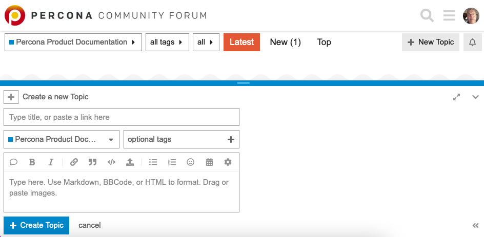

# Documentation Contributing Guide

We welcome contributions from all users and the community. By contributing, you agree to the [Percona Community code of conduct](https://percona.community/contribute/coc/). Thank you for deciding to contribute and help us improve the [Percona XtraBackup documentation](https://www.percona.com/doc/percona-xtrabackup/LATEST/index.html).

You can contribute to the documentation in the following ways:

- Add a topic
- Request a doc change through a Jira issue
- Contribute to the documentation yourself

## Add a topic

In the [Percona Product Documentation category](https://forums.percona.com/c/percona-product-documentation/71) in the Percona Community Forum, select New Topic. Complete the form and select Create Topic to add the topic to the forum.

## Request a doc change through a Jira issue

**Request a doc change through a Jira issue**. If you’ve found a doc issue (a typo, broken links, inaccurate instructions, etc.) create a Jira ticket to let us know about it if you would rather not [contribute to the documentation yourself](#contribute-to-documentation-yourself).

- Click the **Submit DOC bug** link on the sidebar. This opens the [Jira issue tracker](https://jira.percona.com/projects/PXB/issues) for the doc project.
- Sign in (create a Jira account if you don’t have one) and click **Create** to create an issue.
- In the following fields, describe the issue:
    - In the Summary, provide a brief description of the issue
    - In the Description, provide more information about the issue, along with a Steps To Reproduce section, if needed
    - In the Affects Version/s field, if you know this issue affects multiple versions, please enter the version numbers. It is OK to add the version number with an ".x" (such as ``8.0.x``) if you don't know the exact version that must be updated.

## Contribute to documentation yourself

In the sidebar, there is a **This Page** section. The **Edit in GitHub** link opens the source file of the page on GitHub. Make changes, and create a pull request for us to review. For details on how to do these tasks, read on.

To contribute to documentation, learn about the following:

- [reStructuredText](https://www.sphinx-doc.org/en/master/usage/restructuredtext/basics.html) (reST) markup language. This is the format used to write the documentation.
- [Sphinx](https://www.sphinx-doc.org/en/master/usage/quickstart.html) (reST) documentation generator. We use it to convert the source ``.rst`` files to HTML and PDF documents.
- [git](https://git-scm.com/)
- [Docker](https://docs.docker.com/get-docker/). This tool lets you run Sphinx in a virtual environment.

There are several active versions of the documentation. Each version has a branch in the repository named accordingly:

- 2.4
- 8.0

Sphinx and reST generate``.rst`` files which are stored in the ``doc/source`` directory.

### Edit documentation online using GitHub

1. Click the **Edit in GitHub** link on the sidebar. The source ``.rst`` file of the page opens in GitHub editor in your browser. If you haven’t worked with the repository before, GitHub creates a [fork](https://docs.github.com/en/github/getting-started-with-github/fork-a-repo) for you.

2. Edit the page. You can check your changes on the **Preview** tab.

   **NOTE**: GitHub’s native markup language is [Markdown](https://daringfireball.net/projects/markdown/). GitHub's Markdown renders titles, headings, and lists correctly but does not render RestructuredText-specific elements, such as directives or the variable class.

3. Commit your changes.

     - In the *Commit changes* section, add the following sections:
         -      Add a brief summary (72 characters or less) of what was changed
         -      Add details about why and what changed, if needed.
     -       Select the **Create a new branch for this commit and start a pull request** option
     - Click **Propose changes**.

4. GitHub creates a branch and a commit for your changes. It loads a new page on which you can submit a pull request to Percona. The page shows the base branch - the one you offer your changes for, your commit message and a diff - a visual representation of your changes against the original page. At this time you can make a last-minute review. When you are ready, click the **Create pull request** button.
5. A core developer reviews the pull request for accuracy and if everything is correct, merges your pull request into the documentation. Then it gets published on the site at the next release.

**NOTE**: The pull request may be redone to meet internal requirements, for example, aligning the Percona branch to the upstream branch.

### Edit documentation locally

This option is for users who prefer to work from their computer and/or have the full control over the documentation process.

The steps are the following:

1. Fork this repository

1. Clone the forked repository to your machine:

    ```sh
    git clone git@github.com:<your_name>/percona-xtrabackup.git
    cd <directory name>/percona-xtrabackup/storage/innobase/xtrabackup/doc
    ```
3. Add the remote origin repository:

    ```sh
    git remote add origin github.com/percona/percona-xtrabackup.git
    ```

4. Checkout the appropriate branch and pull the latest changes from origin

    ```sh
    git checkout 8.0 && git pull origin 8.0
    ```
Make sure that your local branch and the branch you merge changes from are the same. So if you are on ``8.0`` branch, pull changes from ``origin 8.0``.

5. Create a separate branch for your changes

    ```sh
    git checkout -b <my_changes>
    ```

6. Do your work. Add code examples, if necessary. We recommend that you build an HTML file, either [locally](#Install Sphinx and build locally) or [using Docker](# Use Docker) to view your changes. You can run the command to ``make clean html`` to see the latest changes. If you have questions on formatting, use a [cheat sheet](https://sphinx-tutorial.readthedocs.io/cheatsheet/?highlight=-b#rst-cheat-sheet).
7. Add the changed files.

    ```sh
    git add <changed files>
    ```
8. Commit your changes

    ```sh
    git commit -m 'Fixed typing error in <document name>'
    ```
8. Open a pull request to Percona

    ```sh
    git push <my repo> <my_changes>
    ```

### Building the documentation

To verify how your changes look, generate the static site with the documentation. This process is called *building*. You can use the following methods:
- [Use Docker](#use-docker)
- [Install Sphinx and build locally](#install-sphinx-and-build-locally)

#### Using Docker

1. [Get Docker](https://docs.docker.com/get-docker/)
2. We use [this Docker image](https://hub.docker.com/r/ddidier/sphinx-doc) to build documentation. Run the following command in the ``doc`` directory:

```sh
docker run --rm -i -v `pwd`:/doc -e USER_ID=$UID ddidier/sphinx-doc:0.9.0 make clean html
```
   If Docker can't find the image locally, Docker first downloads the image, and then runs this image to build the documentation.

3. Go to the ``doc/build/html`` directory and open the ``index.html`` file to see the documentation.
4. Your static site will look different from the one on the web site. We use a Percona theme that is rendered when the documentation is published to the website. You can add the following [sphinx-doc options](https://www.sphinx-doc.org/en/master/man/sphinx-build.html) to view the documentation with the [Alabaster](https://alabaster.readthedocs.io/en/latest/) theme

    - ``-b`` selects the builder. This example uses HTML.
    - ``-D`` overrides a selection in conf.py. The example phrase changes the html_theme to ``alabaster``.

    The following example creates a HTML build with the Alabaster theme.    

        ```sh
        docker run --rm -i -v `pwd`:/doc -e USER_ID=$UID ddidier/sphinx-doc:0.9.0 sphinx-build -b html -D 'html_theme=alabaster' source build/html
        ```

1. To create a PDF version of the documentation, run the following command:

    ```sh
    docker run -i -v `pwd`:/doc -e USER_ID=$UID ddidier/sphinx-doc:0.9.0 make clean latex && docker run -i -v `pwd`:/doc -e USER_ID=$UID ddidier/sphinx-doc:0.9.0 make clean latexpdf
    ```

The PDF document is in the ``doc/build/latex`` folder.

#### Installing Sphinx and building locally

1. Install [pip](https://pip.pypa.io/en/stable/installing/)
2. Install [Sphinx](https://www.sphinx-doc.org/en/master/usage/installation.html).
3. While in the root directory of the doc project, run the following command to build the documentation:

    ```sh
    make clean html
    ```

4. Go to the ``doc/build/html`` directory and open the ``index.html`` file to see the documentation.

5. Your static site will look different from the one on the web site. This is because we use a Percona theme that is rendered when the documentation is published on the web. To view the documentation with Alabaster theme, run the following command:

    ```sh
    sphinx-build -b html -D 'html_theme=alabaster' source build/html
    ```

6. To create a PDF version of the documentation, run the following command:

    ```sh
    make clean latexpdf
    ```

This command does two tasks. The ``clean`` command rebuilds the ``doc/build`` directory and the ``latexpdf`` commands creates a PDF document. The PDF document is stored in the ``doc/build/latex`` folder.
